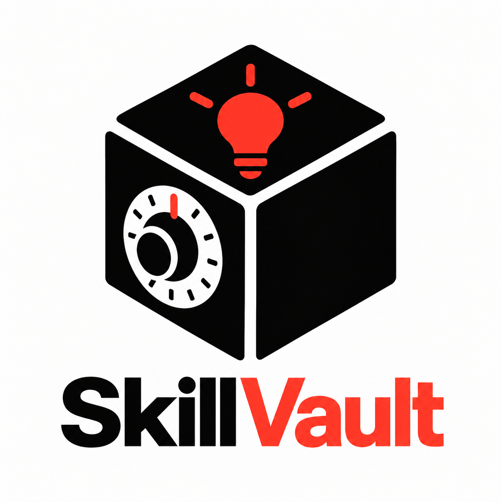

<p align="center">
  
</p>

<h1 align="center">Skill Vault</h1>

<p align="center">
  <strong>Universal local-first skill and prompt layer for AI on the web.</strong><br>
  Save once. Use with any AI.
</p>

---

## 🌟 Overview

Skill Vault is a Manifest V3 Chrome Extension that bridges the gap between your personal prompt library and web-based AI chat interfaces (**ChatGPT**, **Claude**, **Gemini**).

- 📦 **Local-First Architecture:** All skills and settings are stored directly in your browser (`chrome.storage.local`). Zero analytics, zero tracking, zero server calls.
- ⚡ **In-Composer `/skill` Palette:** Type `/skill` or `/skill <query>` inside ChatGPT, Claude, or Gemini to trigger a keyboard-driven command palette rendered in an isolated Shadow DOM.
- 🎯 **Non-Destructive Safe Injection:** Selected skills replace the `/skill` command with your formatted prompt without ever automatically pressing "Send".
- 📝 **Right-Click to Save:** Highlight any text on any webpage, right-click, and choose **Save selection as Skill** to immediately draft a reusable skill.
- 🗂️ **Side Panel Management:** Clean, modern management UI to create, edit, search, tag, favorite, and back up skills as JSON.

---

## 🚀 Quick Start & Installation

### 1. Build the Extension

```bash
# Install dependencies
npm install

# Generate PNG icons from public/icons/icon.svg
npm run generate-icons

# Run test suite
npm run test

# Build extension to /dist
npm run build
```

### 2. Load into Chrome / Edge / Brave

1. Open your browser and navigate to `chrome://extensions` (or `edge://extensions`).
2. Toggle **Developer mode** in the top right corner.
3. Click **Load unpacked**.
4. Select the `skill-vault/dist` directory.
5. Pin the **Skill Vault** icon in your browser toolbar!

---

## 💻 How to Use

### 1. Managing Skills (Side Panel)

- Click the **Skill Vault** extension icon in your toolbar to open the Chrome Side Panel.
- Browse curated seed skills (**Code Review**, **Explain Simply**, **Professional Rewrite**, **Bug Investigator**).
- Click **+ New Skill** to create your own skills with custom shortcuts (e.g., `review`, `explain`, `debug`).
- Use variables like `{{selected_text}}`, `{{current_date}}`, `{{page_title}}`, `{{page_url}}`.

### 2. Triggering `/skill` in AI Chats

1. Navigate to [ChatGPT](https://chatgpt.com), [Claude](https://claude.ai), or [Gemini](https://gemini.google.com).
2. Click into the message prompt box.
3. Type:
   ```text
   /skill
   ```
   or filter directly:
   ```text
   /skill review
   ```
4. Use <kbd>↑</kbd> and <kbd>↓</kbd> to navigate, and press <kbd>Enter</kbd> to insert the skill prompt directly into the composer.

### 3. Save Text from Any Webpage

1. Highlight text on any page (e.g. an interesting article, prompt, or code snippet).
2. Right-click and choose **"Save selection as Skill"**.
3. The Side Panel will open with a draft prompt ready to name and save!

---

## 🛠️ Tech Stack & Architecture

- **Manifest V3:** Background Service Worker (`src/background/`)
- **UI Framework:** React 19 + Vanilla CSS (`src/sidepanel/`)
- **Content Runtime:** Vanilla TypeScript + Web Components & Shadow DOM (`src/content/`)
- **AI Adapters:** Modular adapter engine for ChatGPT, Claude, Gemini, and Generic fallback (`src/adapters/`)
- **Build System:** Vite (`scripts/build.mjs`)
- **Testing:** Vitest (`tests/`)

---

## 🧪 Development Commands

```bash
# Run tests
npm test

# Typecheck
npm run typecheck

# Build bundle to /dist
npm run build
```
